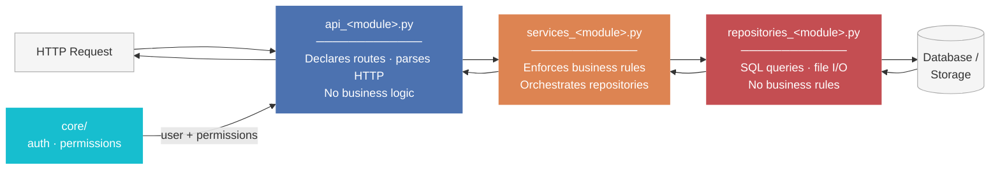
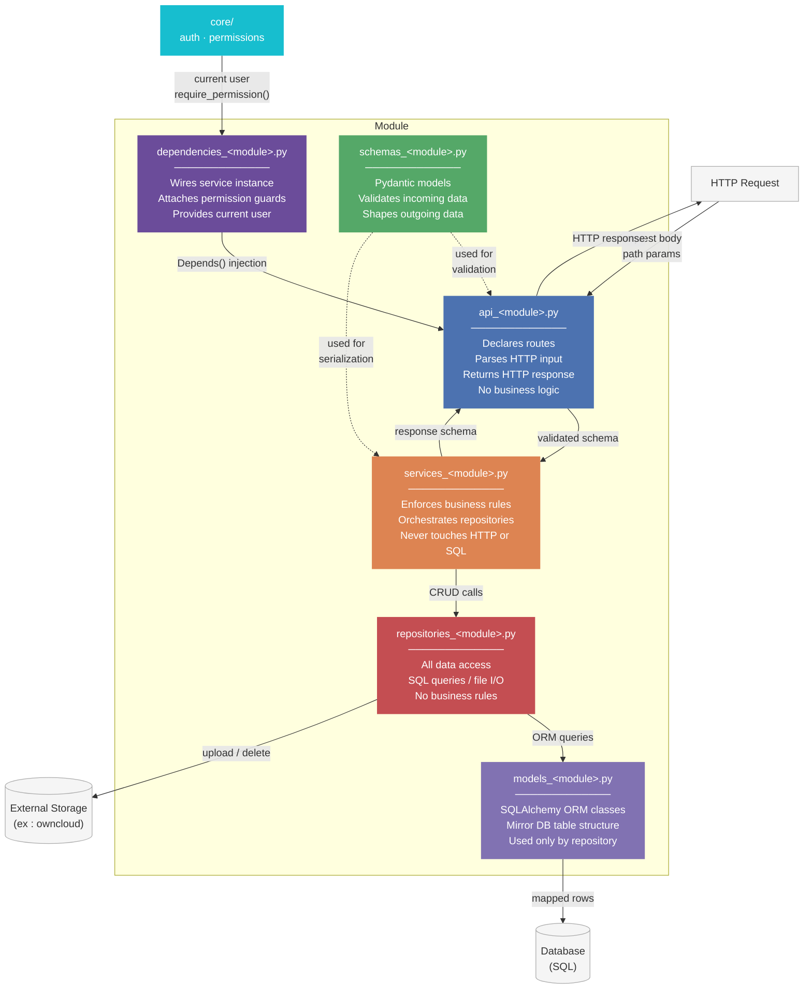

# Module System

A **module** is a self-contained business domain. Each module owns its own API routes, ORM models, schemas, service logic, data access, and FastAPI dependencies. Modules never talk to each other directly.

---

## Anatomy of a module

```text
modules/<module_name>/
├── __init__.py
├── api_<module_name>.py             # APIRouter — all HTTP endpoints for this domain
├── models_<module_name>.py          # SQLAlchemy ORM model(s)
├── schemas_<module_name>.py         # Pydantic schemas (Create, Read, Update)
├── service_<module_name>.py         # Business logic — orchestrates repositories
├── repositories_<module_name>.py    # Data access — SQL queries, file I/O, external APIs
└── dependencies_<module_name>.py    # FastAPI Depends: inject services, check permissions
```

---

## Simplified flow



---

## Detailed data flow

The diagram below shows how all files interact for a typical request.



| File | Talks to | Never talks to |
| --- | --- | --- |
| `api_*.py` | `dependencies_*.py`, `schemas_*.py` | `repositories_*.py`, `models_*.py` |
| `dependencies_*.py` | `core/`, `services_*.py`, `shared/db` | `repositories_*.py` directly |
| `services_*.py` | `repositories_*.py`, `schemas_*.py` | HTTP layer, `core/auth` |
| `repositories_*.py` | `models_*.py`, DB/storage | `services_*.py`, `schemas_*.py` |
| `schemas_*.py` | — (pure data classes) | ORM models, database |
| `models_*.py` | `shared/db/base.py` | Everything above the repository |

---

## Layer responsibilities

### api/ — HTTP only

The router translates HTTP into function calls and back. It contains **no business logic**.

```python
# modules/video/api/router.py
from fastapi import APIRouter, Depends, UploadFile
from modules.video.schemas.video import VideoCreate, VideoRead
from modules.video.dependencies.deps import get_video_service, require_video_write
from modules.video.service.video_service import VideoService

router = APIRouter(prefix="/videos", tags=["video"])

@router.post("/", response_model=VideoRead, status_code=201)
async def upload_video(
    data: VideoCreate,
    file: UploadFile,
    user=Depends(require_video_write),
    service: VideoService = Depends(get_video_service),
):
    return await service.create(data, file, owner_id=user.id)
```

The router does not instantiate services or repositories. It only receives them via `Depends`.

### service/ — Business logic

The service is the only place where business rules are enforced. It coordinates repositories but does not write SQL directly.

```python
# modules/video/service/video_service.py
class VideoService:
    def __init__(self, meta_repo: MetadataRepository, storage_repo: StorageRepository):
        self.meta_repo = meta_repo
        self.storage_repo = storage_repo

    async def create(self, data: VideoCreate, file: UploadFile, owner_id: str) -> VideoRead:
        storage_url = await self.storage_repo.upload(file)
        video = await self.meta_repo.create(data, storage_url=storage_url, owner_id=owner_id)
        return VideoRead.model_validate(video)

    async def delete(self, video_id: str, requester_id: str) -> None:
        video = await self.meta_repo.get_or_404(video_id)
        assert_owner(video.owner_id, requester_id)   # core/security/guards.py
        await self.storage_repo.delete(video.storage_url)
        await self.meta_repo.delete(video_id)
```

### repository/ — Data access

Repositories contain **only** data access logic: SQL queries, file system operations, or external API calls. No business rules.

For the video module, two repositories are used — keeping SQL and file storage concerns fully separated:

```python
# modules/video/repository/metadata_repo.py
class MetadataRepository:
    def __init__(self, session: AsyncSession): ...
    async def create(self, data: VideoCreate, storage_url: str, owner_id: str) -> VideoMetadata: ...
    async def get_or_404(self, video_id: str) -> VideoMetadata: ...
    async def list(self, params: PageParams) -> Page[VideoMetadata]: ...
    async def delete(self, video_id: str) -> None: ...

# modules/video/repository/storage_repo.py
class StorageRepository:
    async def upload(self, file: UploadFile) -> str: ...     # returns public URL
    async def delete(self, url: str) -> None: ...
    async def get_signed_url(self, url: str) -> str: ...
```

The service receives both repositories via its constructor — it never instantiates them itself.

### schemas/ — Validation and serialization

Pydantic v2 schemas define the shape of data **entering and leaving** the API. They are the contract between client and server.

```python
# modules/video/schemas/video.py
from pydantic import BaseModel
from datetime import datetime

class VideoCreate(BaseModel):
    title: str
    description: str | None = None
    tags: list[str] = []

class VideoRead(BaseModel):
    id: str
    title: str
    description: str | None
    tags: list[str]
    storage_url: str
    owner_id: str
    created_at: datetime

    model_config = {"from_attributes": True}
```

### dependencies/ — Wiring

Module dependencies are thin glue functions that wire repositories and services together and attach permission guards.

```python
# modules/video/dependencies/deps.py
from fastapi import Depends
from sqlalchemy.ext.asyncio import AsyncSession
from shared.db.session import get_db
from core.permissions.dependencies import require_permission
from modules.video.repository.metadata_repo import MetadataRepository
from modules.video.repository.storage_repo import StorageRepository
from modules.video.service.video_service import VideoService

def get_video_service(db: AsyncSession = Depends(get_db)) -> VideoService:
    return VideoService(
        meta_repo=MetadataRepository(db),
        storage_repo=StorageRepository(),
    )

# Pre-composed permission guard for this module
require_video_write = require_permission("video:write")
require_video_read  = require_permission("video:read")
```

---

## Isolation rules

| Rule | Rationale |
| --- | --- |
| A module never imports from another module | Prevents hidden coupling and circular dependencies |
| A module never calls `core` services directly from a router | The router only calls the module's own service |
| Shared business logic lives in `core`, not duplicated in modules | Single source of truth |
| Each module owns its own ORM models | Schema changes in one module don't affect others |

---

## Registering a new module

Once a module has a router, it is automatically included in the API by `main.py`. 

Each router defines its own `prefix` and `tags` internally, so the only thing `main.py` adds is the global API version prefix.

---

## Currently available modules

| Module | Prefix | Status |
| --- | --- | --- |
| `descript_sketches` | `/descript-sketches` | In development |
| `aquanote` | `/aquanote` | In development |
